# Cross Site Scripting (XSS)


### Fakultät Informatik - Studiengang IT Security B.Sc.
### Modul 13000 - Einführung offensive Security-Methoden
Betreuer: Prof. Dr. Christian Henrich, Dr. Demir, Nurullah

Informationen zum Vortrag von Fabian Hans Flad - 10.01.2025

# Inhaltsverzeichnis
1. [Definition: Was ist Cross Site Scripting (XSS)](#1)
2. [Grundlagen: Aufbau von Internetseiten](#2)
3. [Praktische Umsetzung eines XSS Angriffs](#3)
    1. [Stored XSS Angriff - Gästebuch](#3.1)
    2. [Reflected XSS Angriff - Manipulierte URL](#3.2)
4. [Gegenmaßnahmen](#4)
    1. [Web Entwickler](#4.1)
    2. [Endnutzer](#4.2)
5. [Fazit](#5)
6. [Quellen](#6)

# 1. Definition: Was ist Cross Site Scripting (XSS)<a id="1"></a>

>_„Bei einem Cross-Site-Scripting-Angriff (…), **wird  Schadcode in ansonsten vertrauenswürdige Webseiten eingeschleust**. 
Der Browser des Opfers erkennt nicht, dass die Skripte nicht vertrauenswürdig sind, und führt sie bedenkenlos aus.“_ 
[(vgl. AO Kaspersky Lab 2024)](https://www.kaspersky.de/resource-center/definitions/what-is-a-cross-site-scripting-attack) 

>_"Dieser bösartige Code ist dann in der Lage, den **Inhalt der Webseite zu verfälschen** (z. B. eine Falschmeldung auf der Webseite einer Zeitung zu platzieren) oder **vertrauliche Daten auszulesen** (z.B. das Passwort des Opfers)."_ (vgl. Schwenk 2020)

Bei XSS Angriffen wird zwischen **Stored** und  **Reflected XSS** Angriffen unterschieden:

|Stored XSS 💾| Reflected XSS 🔗|
|---------------------|---------------------------|
| Schadcode wird **dauerhaft**  auf dem Server der Zielwebsite gespeichert (persistent) und auch dauerhaft an Besucher der Website übertragen. Der Schadcode wird **bei allen Besuchern** der Website ausgeführt.| Der Schadcode wird **nicht dauerhaft** auf dem Server der Ziel-Internetseite gespeichert. Er wird meistens über eine **manipulierte URL** eingeschleust. Bei Reflected XSS Angriffen werden in der Regel **gezielt einzelne User** angegriffen.|


# 2. Grundlagen: Aufbau von Internetseiten<a id="2"></a>

Internetseiten setzen sich aus HTML, CSS und JavaScript-Code zusammen. Der Code wird vom Server der Website an den Nutzer geschickt. Dieser wird dann vom Browser gelesen und zu einer grafischen Oberfläche zusammengefügt.

|Komponente  | Funktion| Symbolisch|
|---------------------|---------------------------|---------------------------|
|**HTML**| Grundgerüst der Internetseite. Definiert die Grundstruktur: Zu welcher Kategorie gehört ein Inahlt? | 🦴 Skelett |
|**CSS**| Sorgt für das "Styling" der Internetseite.  Definiert Farbe, Schriftart und Formatierung.| 👦 Haut |
|**JavaScript**| Macht die Internetseite interaktiv. Sorgt dafür, dass Inhalte dynamisch nachgeladen werden und Funktionen ausgeführt werden. | 🧠 Gehirn |

<ins>Grundlegende Funktionsweise von HTML</ins>

Die Tags `</>` ordnen den Text bzw. Inhalt der Website bestimmten Kategorien, wie Überschriften oder Listenelementen, zu. 

```html
<html>
<body>
    <h1 id="Titel">Hello World</h1>
    <ul>
        <li>Listenelement Eins</li>
        <li>Listenelement Zwei</li>
    </ul>
</body>
</html>
```
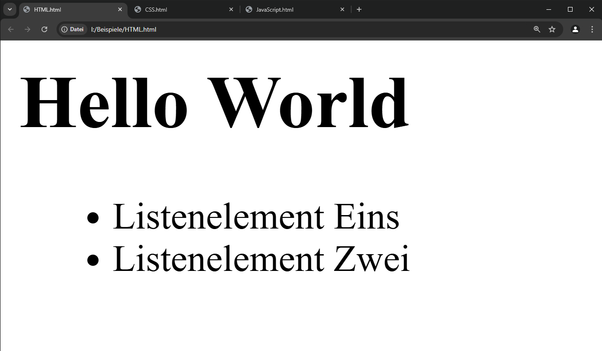

<ins>Grundlegende Funktionsweise von CSS</ins>

Im CSS Style Sheet werde für die HTML-Tags bestimmte Design-Eigenschaften definiert:

```CSS
body {
    /* Schriftfarbe */
    color: blue; 
     /* Schriftart */
    font-family: sans-serif;
    /* Hintergrund Farbe */
    background: black;
	}        

```


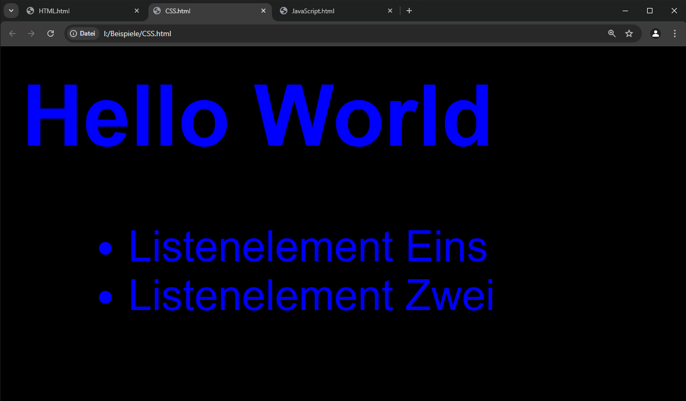

<ins>Grundlegende Funktionsweise von JavaScript</ins>

JavaScript macht die Internetseite interaktiv:
```JS
// Zugriff auf Tags mit bestimmer ID
let Titel = document.getElementById("Titel"); 

// Ersetzt Inhalt des HTML-Tags
Titel.innerHTML = "Hallo Kurs"
```

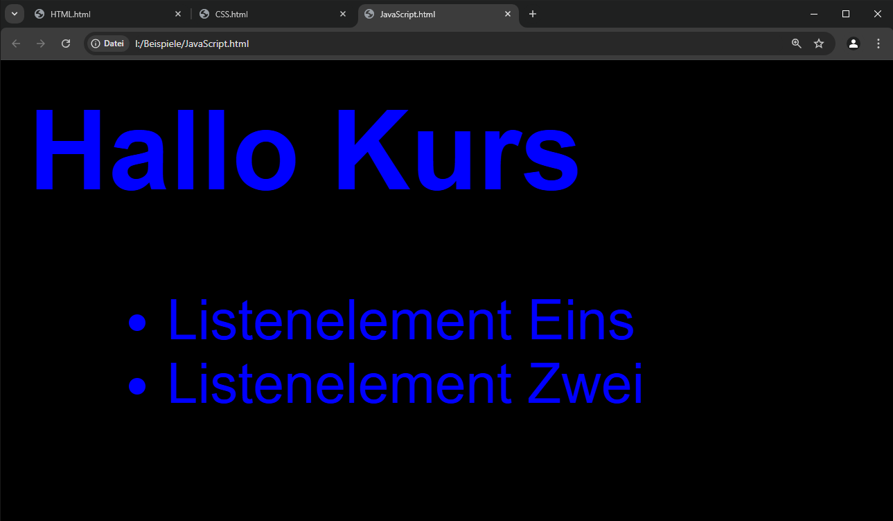


JavaScript kann über Script Tags in HTML-Dokumente eingebunden werden. Der Code kann direkt zwischen den Script Tags stehen oder verlinkt werden:

```Html
<html>
    <head>
        <script>alert("Hello World")</script>
        <script src="Quelle.js"></script>
    </head>
</html>
```

# 3. Praktische Umsetzung eines XSS Angriffs<a id="3"></a>

Angriffsvektoren: Schädlicher JavaScript Code kann über **User-Eingabefelder** oder **URL-Parameter** auf vertrauenswürdige Ziel-Websiten eingeschleust werden. Auf vielen Internetseiten wird dieser User-Input direkt angezeigt bzw. wird in das Dokument eingebunden:

- Bei Seiten mit Suchfunktionen wird häufig der Suchbegriff nochmals ausgegeben.
- In Kommentarspalten oder Gästebüchern wird ebenfalls häufig User-Input dauerhaft angezeigt.
- Auf Internetseiten können Suchbegriffe oder andere Funktions-Parameter über die URL übergeben werden.

## 3.1 Stored XSS Angriff - Gästebuch<a id="3.1"></a>

Wir betrachten als Beispiel die fiktive Website der _"Bäckerei Albstadt"_. Diese hat ein Gästebuch. Über zwei Eingabefelder können der Name und und eine Nachricht eingegeben werden:

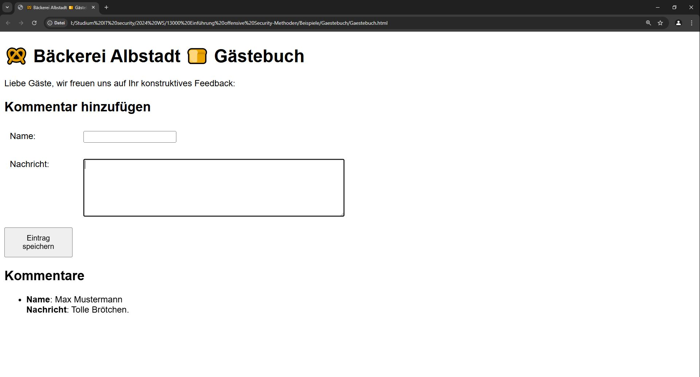

Wir testen die Eingabefunktion und geben eine Testnachricht ein:

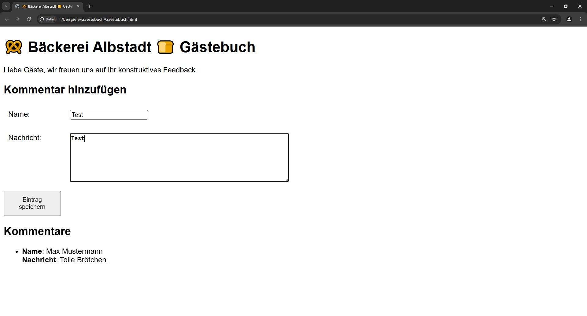

Der eingegebene Name und die Nachricht werden auf der Website in der Kommentarspalte angezeigt.

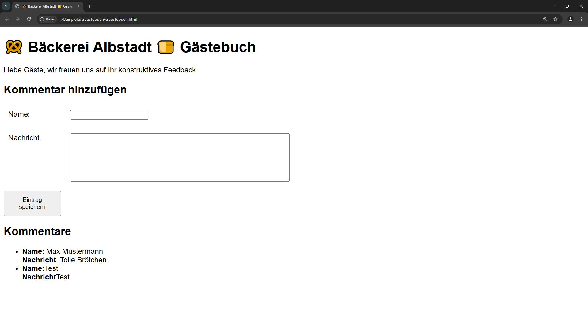

Wir prüfen den Quelltext der Internetseite mit den Entwicklungstools.
Die Internetseite ordnet jedem Kommentar eine `id` zu. Die `id` des Kommentars von Max Mustermann lautet _"Kommentar_0"_. Der von uns eingegebene Kommentar erhielt die `id` _"Kommentar_1"_

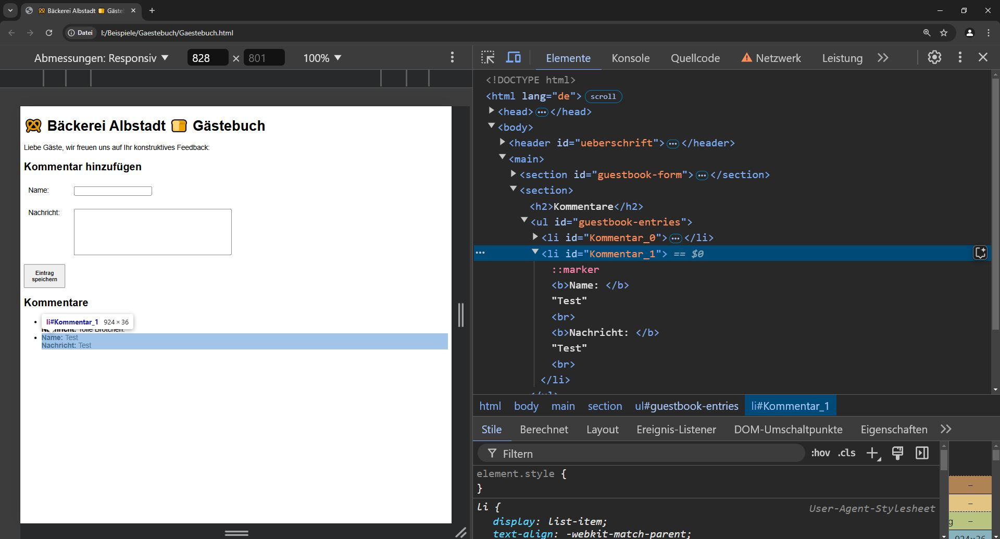

Wir nutzen diese Informationen. Über die Eingabefunktion wird folgendes Skript injeziert:

```html
<script>
let MaxMustermann = document.getElementById("Kommentar_0");
MaxMustermann.innerHTML = "<b>Name:</b> Max Mustermann <br><b>Nachricht:</b> Schmeckt überhaupt nicht!";
</script> Mir schmeckt's auch nicht!
```

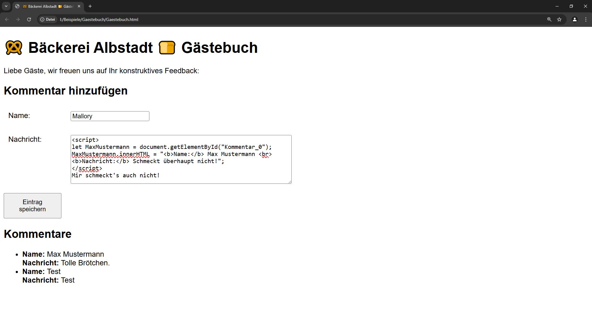

Die Website hat sich verändert. Das über die Kommentarspalte eingeschleuste Skript wurde in die Website eingebunden und ausgeführt:

```JavaScript
let MaxMustermann = document.getElementById("Kommentar_0");
MaxMustermann.innerHTML = "<b>Name:</b> Max Mustermann <br><b>Nachricht:</b>Schmeckt überhaupt nicht!";
```
- Der Code greift auf über die `id` _"Kommentar_0"_ auf den Tag des Kommentars von Max Mustermann zu.
- Dem Kommentar-Tag von Max Mustermann wird ein neuer HTML-Inhalt zugewiesen. Der Inhalt wurde verfälscht.
- Der Teil, der außerhalb des `<script>`-Tags eingegeben wurde: _"Mir schmeckt's auch nicht!"_ wird nicht als Skript interpretiert und daher normal auf der Website im Kommentar-Bereich angezeigt.

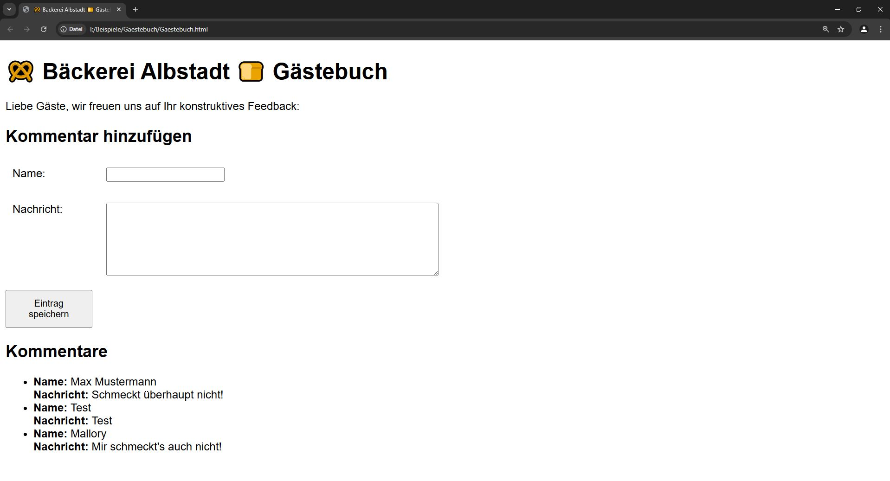

Im Quelltext der Website wird sichtbar, wie das Skript in die Website injeziert wurde.

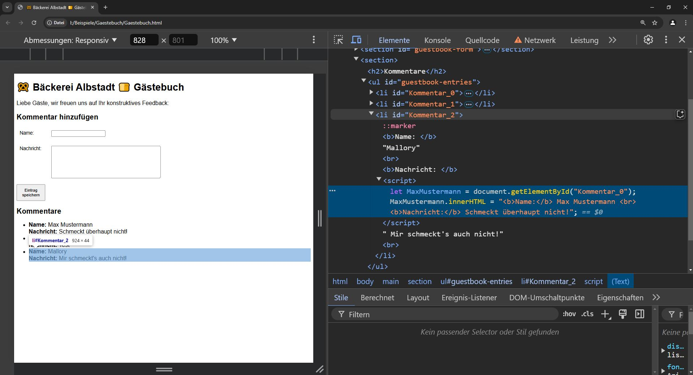


## 3.2 Reflected XSS Angriff - Manipulierte URL<a id="3.2"></a>

Wir betrachten als Beispiel die fiktive Website des Stadtarchivs Albstadt. Diese hat eine Suchfunktion. Über ein Eingabefeld können Suchbegriffe eingegeben werden:

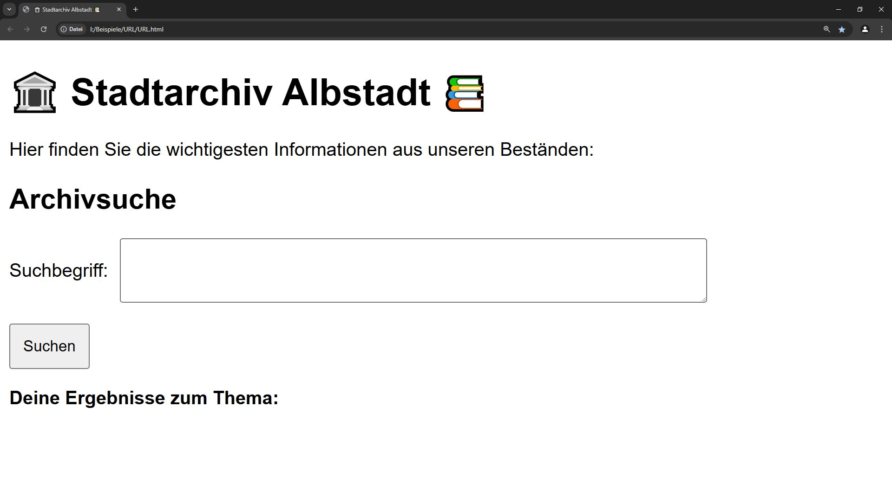

Wir testen die Suchfunktion und geben den Begriff _"Test"_ ein.

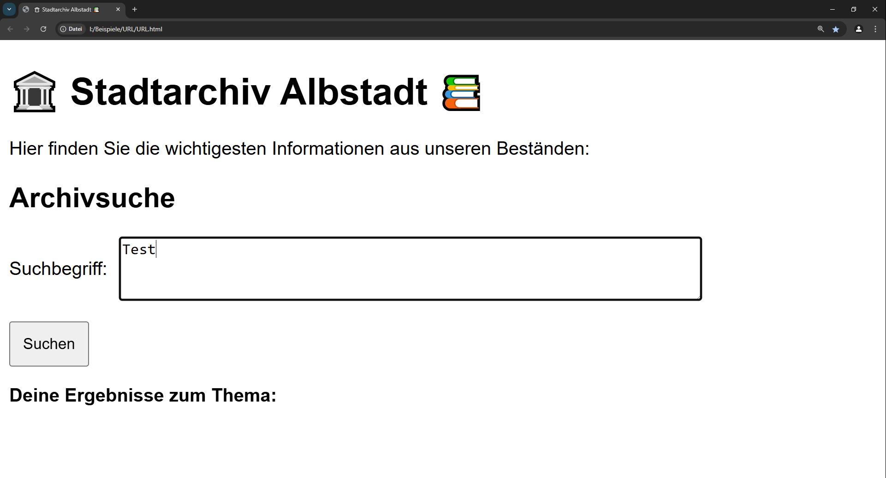

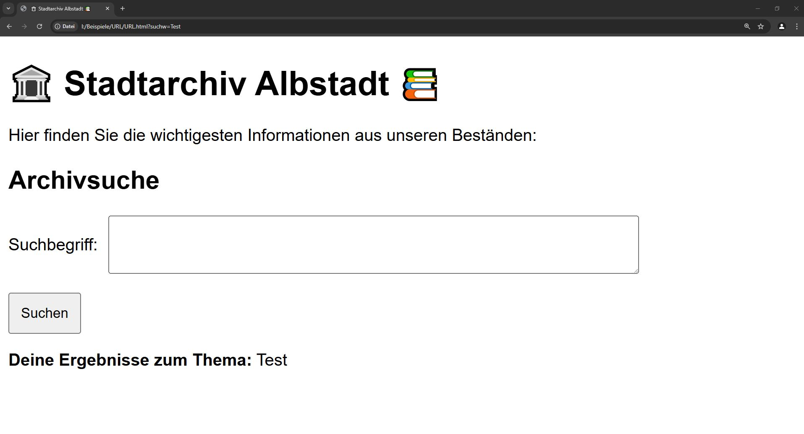

Der Suchbegriff wird auf der Website nochmals ausgegeben. Darüber hinaus, wird der Suchbegriff in der URL angezeigt: `?suchw=Test`. 

Die Suche lässt sich über die URL reproduzieren.

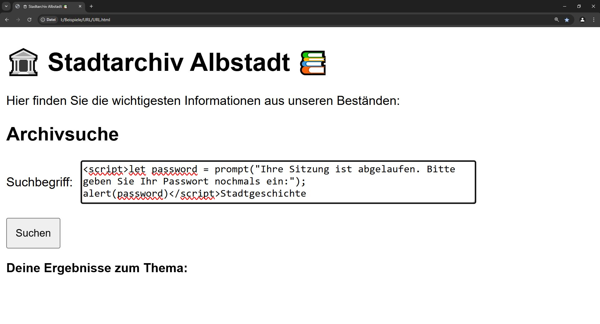

Wir versuchen ein Skript in über das Suchfeld zu injezieren.

```html
<script>
let password = prompt("Ihre Sitzung ist abgelaufen. Bitte geben Sie Ihr Passwort nochmals ein:");
alert(password)
</script>Stadtgeschichte
```

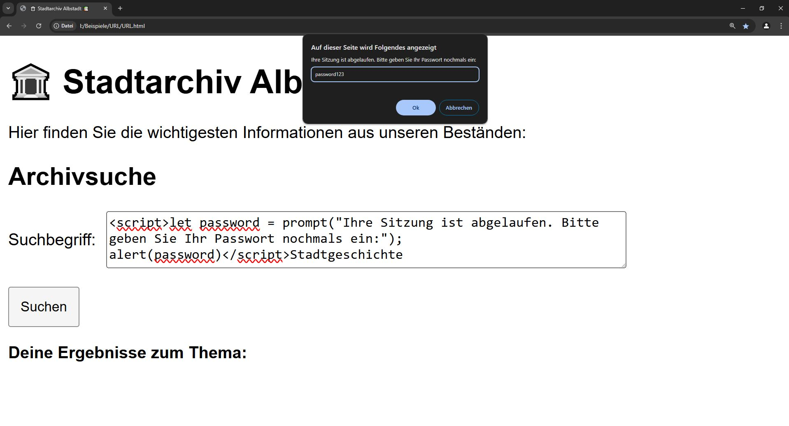
Die Eingabe wird besätigt. Die Website hat sich verändert. Das über die Suchfunktion eingeschleuste Skript wurde in die Website eingebunden und ausgeführt:

```JavaScript
let password = prompt("Ihre Sitzung ist abgelaufen. Bitte geben Sie Ihr Passwort nochmals ein:");
```
Dieser Code führt dazu, dass ein Dialogfeld auftaucht und den Nutzer dazu auffordert sein Passwort einzugeben. Dieses wird in der Variable _"password"_ gespeichert.

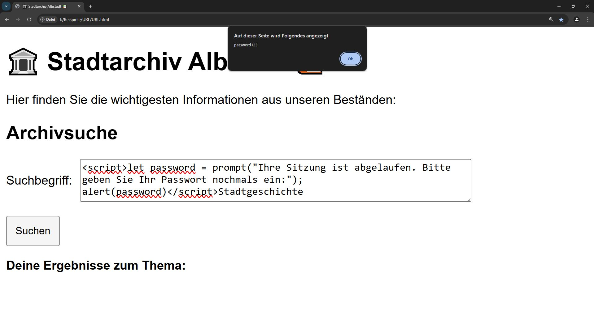

```JavaScript
alert(password);
```

Das Passwort wird über ein Fenster ausgegeben. 

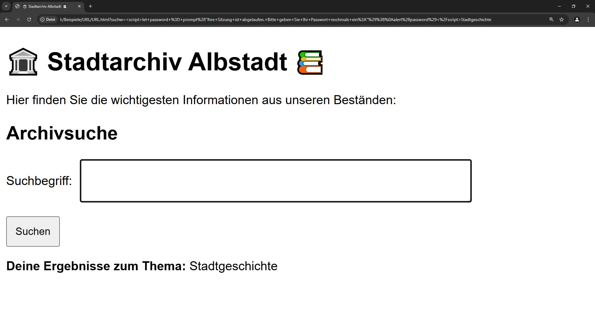

Ein Blick in den Quellcode Ziegt, wie das Skript in die Website eingebunden wurde. Nur der außerhalb des `<script>`-Tags stehende Text _"Stadtgeschichte"_ wird als normaler Text gelesen.

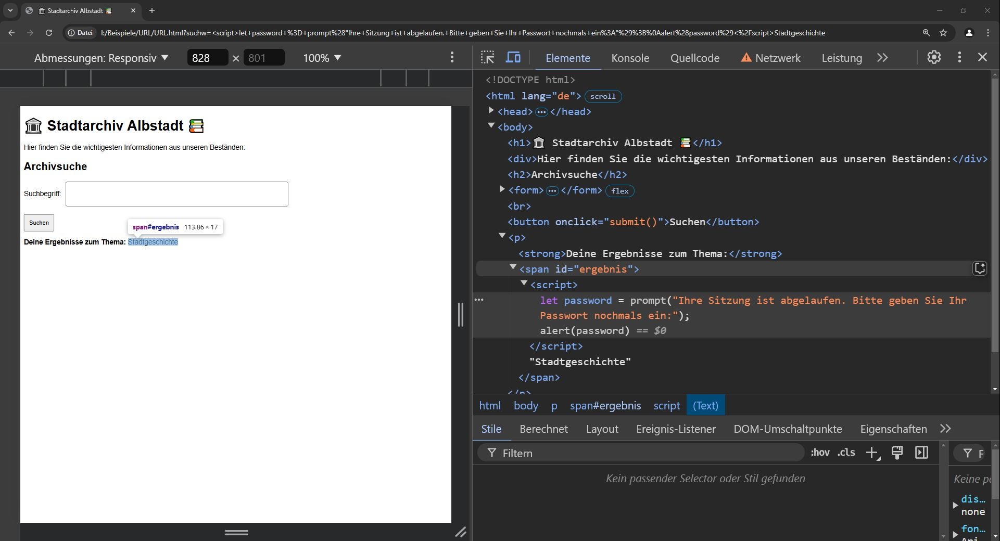

Der Suchtext und damit auch das Skript ist in der URL hinter deer Variable `?suchw=` gespeichert. 


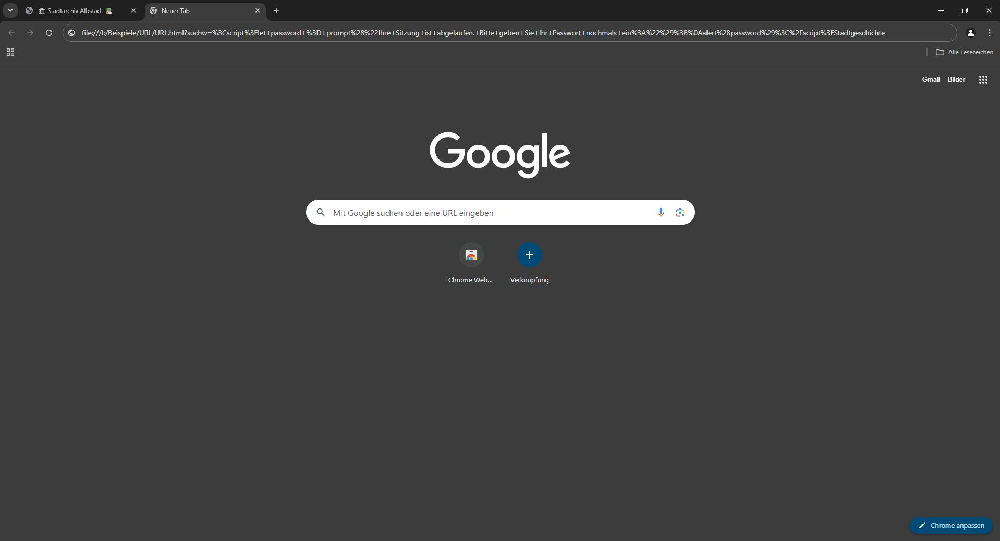

Die URL lässt sich in einem neuen Tab eingeben. Dadurch wird das gleiche Ergebnis reproduziert:

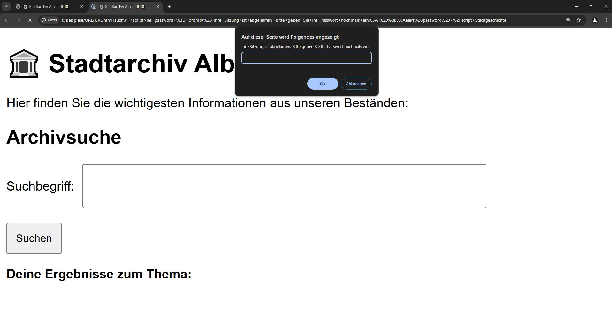

Die manipulierte URL kann per Mail an potentielle Opfer übermittelt werden. 

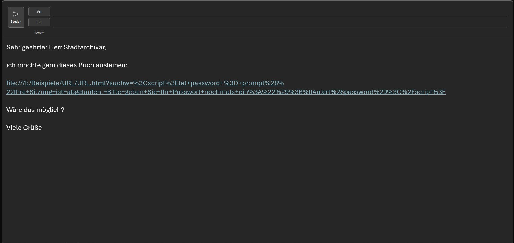

Der lange Text der manipulierten URL lässt sich in der Mail  in einem `<a>`-Tag "verstecken".


# 4. Gegenmaßnahmen<a id="4"></a>

Im Folgenden werden Gegenmaßnahmen für die Gruppen _"Web Entwickler"_ und _"Endnutzer"_ diskutiert:

|Web Entwickler 👨‍💻|Endnutzer 🧑|
|---------------|----------|
|Wie lassen sich Websiten **sicher gestalten**?| Wie lassen sich Websiten **sicher nutzen**?|

## 4.1 Web Entwickler<a id="4.1"></a>

### Security by Design 

Sicherheitsaspekte sollten von Anfang an im Entwicklungsprozess berücksichtigt werden. Sicherheitsrelevantes Verhalten von Funktionen und Methoden sollte bei der Entwicklung bedacht werden:

```JavaScript 
// Unsichere Methode: .innerHTML
let element = document.getElementById("id")
element.innerHTML = userInput 
```

Bei dieser Methode wird der user Input als HTML-Element interpretiert.

Bessere Alternative:

```javaScript 
// Besser: .textContent
let element = document.getElementById("id")
element.textContent = userInput
``` 
Bei dieser Methode wird der Input als Text interpretiert.

### User Input Filtern 

Der Input der User sollte vor einer weiteren Verwendung gefiltert werden.  Bei der Filterung von User Input können Black List und White List Verfahren zur Anwendung kommen:

|⚫ Black List Verfahren|⚪ White List Verfahren|
|--------------------|---------------------|
|Aus dem User Input werden gezielt schädliche Zeichen, wie `<` oder `>` **entfernt**. | Bei diesem Verfahren werden nur bestimmte, vordefinierte Eingaben akzeptiert. Es wird  eine **Liste von zulässigen Eingaben** erstellt. |
|Verbotene Zeichen können leicht substituiert werden. **Sicherheit ist fragil.** | Das White List Verfahren ist **effektiv**, da es die Angriffsfläche reduziert und sicherstellt, dass nur vertrauenswürdige Daten verarbeitet werden. |


### Empfehlungen des BSI

>_"Alle Daten aus nicht-vertrauenswürdigen Quellen, die von der Webanwendung verarbeitet werden, müssen in eine **einheitliche Form** überführt werden (z. B. durch Kanonalisierung) bevor sie **validiert** und ggf. enkodiert oder maskiert werden. (...) Um Schwachstellen wie beispielsweise Cross-Site-Scripting (XSS) (...) zu vermeiden, müssen für alle Daten entsprechende **Validierungs- und ggf. Enkodierungs- und Filterfunktionen** verwendet werden."_ (Goldene-Regeln-Webanwendungen BSI)


## 4.2 Endnutzer<a id="4.2"></a>

### JavaScript abschalten

In den meisten Internet Browsern kann JavaScript abgeschalten werden. Im Zweifelsfall kann beim Besuch verdächtiger Internetseiten die Ausführung von JavaScript abgeschalten werden.

### Vorsicht bei Links

Bei auffällig langen Links ist grundsätzlich Vorsicht geboten. Moderne Internet-Browser und E-Mail Programme können dabei helfen XSS Angriffe frühzeitig zu erkennen. 

# 5. Fazit<a id="5"></a>

- Sicherheit fängt bereits bei der Entwicklung und Architektur einer Website an und sollte frühzeitig bedacht werden.
- Input von Nutzern sollte stets kritisch betrachtet werden. User-Input muss stets gefiltert und validiert werden.
- Bei Links ist Vorsicht geboten. 
- Auch vermeintlich vertrauenswürdige Websiten können mit Schadcode injeziert sein.

# 6. Quellen<a id="6"></a>
<ins>Literatur</ins>
- **Ackermann, Philip** - Rheinwerk Verlag - JavaScript - Das umfassende Handbuch - 3 Auflage 2021 S. 416 f.
- **Kofler Michael et al** - Rheinwerk Verlag  - Hacking & Security - Das umfassende Handbuch 3 Auflage 2023 - S. 850 ff.
- **Schwenk Jörg** - Springer - Sicherheit und Kryptographie im Internet 5. Auflage S. 449 ff.  

<ins>Internet-Quellen</ins>
- [**Bundesamt für Sicherheit in der Informationstechnik (BSI)** Goldene Regeln Baustein B 5.21 Webanwendungen](https://www.bsi.bund.de/SharedDocs/Downloads/DE/BSI/Grundschutz/Download/IT-GS-Bausteine/Webanwendungen/Goldene-Regeln-Webanwendungen.pdf?__blob=publicationFile)
- [**Kaspersky Lab** - Definitions - What is a cross site scripting attack](https://www.kaspersky.de/resource-center/definitions/what-is-a-cross-site-scripting-attack) 
